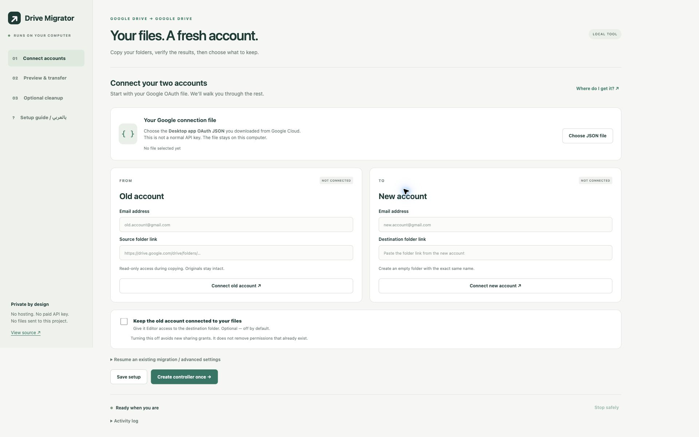

# Drive Account Migrator

**Move your Google Drive data to another account, keep an optional link to the old account, and clean up only after verification.**

A local browser interface and a deterministic Python worker. No hosted service, AI calls, paid API key, or third-party Python dependencies. Each person connects their own Google accounts using their own OAuth desktop client.

[العربية](README.ar.md) · [Google setup](docs/setup.md) · [Recovery & safety](docs/safety.md) · [Command line](docs/cli.md)



## Start here

Install a supported [Python 3](https://www.python.org/downloads/) release (3.10 or newer recommended), then download this repository as a ZIP and extract it, or clone it:

```sh
git clone https://github.com/HostX0/drive-account-migrator.git
cd drive-account-migrator
python3 -m drive_migrator gui
```

On Windows, use `py -3 -m drive_migrator gui`. You can also double-click **Start Windows.bat** or **Start macOS.command** after extracting the repository. If macOS does not run the launcher, use the terminal command above.

A private page opens at `127.0.0.1`. Keep its terminal open. The interface explains where to obtain the OAuth JSON and offers:

1. **Connect accounts:** select the desktop OAuth JSON, enter two email addresses and two folder links, then approve each account in Google's browser flow.
2. **Preview & transfer:** build a live, read-only inventory, review it, then start/resume a bounded copy run.
3. **Optional cleanup:** separately authorize source cleanup, review an exact list, and choose Trash or permanent deletion.

**An API key alone cannot access private Drive files.** Follow the [one-time OAuth setup](docs/setup.md). Share the source folder with the new account as Viewer so the new account can make its own copies. Use a destination folder with exactly the same name, owned by the new account. For an existing migration, reuse its controller and local state; do not create another mirror.

## Choose whether the old account keeps access

The checkbox **“Keep the old account connected to your files”** controls `share_source`:

| Setting | Behavior |
|---|---|
| `false` (default) | Creates copies without adding new access for the old account. |
| `true` | Grants the old account Editor access to the destination root and verifies that access for new items and cleanup candidates. |

Turning the option off does **not** revoke existing or inherited permissions. Review destination sharing in Google Drive if you need exclusive access.

## What it does

- Preserves exact names, hierarchy, empty folders and separate same-name source folders.
- Uses complete paginated listings from both accounts before comparing a folder.
- Runs copies as the destination account and checks destination ownership, names, type, parent and available binary checksums.
- Keeps a durable SQLite intent/result journal and a native Google Docs controller with revision-guarded, bounded leases.
- Recovers mappings from nested controller records, respects exclusions, and reconciles uncertain copy responses before considering another mutation.
- Retains edited copies and ambiguous matches. It never overwrites destination files or empties all Trash.
- Has a read-only preview, private local reports, a safe-stop button and separate, hash-bound cleanup plans.

## Scope and limitations

This is an **early release for personal Google Drive folder trees**, not a complete Google account export. Gmail, Photos, shared-drive ownership migration, shortcuts, third-party Drive files, comments, revision history and every document-specific permission/link are not guaranteed to migrate. Unsupported items are recorded and left alone.

Native Docs, Sheets, Slides, Drawings and Forms can be copied when Google allows it, but this worker does not certify full native-content equivalence. **Automatic cleanup excludes all native Google files and folders.** It requires mapped binary files with matching available hashes, unchanged versions, correct ownership and live copies. It is deliberately possible for a run to finish with retained items.

An unrecognized existing folder or native document is not adopted by name alone. Import trusted mappings into the controller or review the conflict manually. Do not delete the local state directory to “fix” a conflict.

**Trash still consumes storage. Permanent deletion cannot be undone.** Only verified originals already trashed by this tool can enter its purge plan; unrelated Trash is never included. Google's storage meter may lag after large deletions. [Google's storage guidance](https://support.google.com/drive/answer/6374270?hl=en).

The project never enables billing or purchases storage. Destination capacity and Google API quotas still apply; check Google's current [Drive API limits](https://developers.google.com/workspace/drive/api/guides/limits) for large migrations.

## Development

```sh
python3 -m unittest discover -s tests
python3 -m compileall -q drive_migrator
```

Tests run offline with synthetic accounts and an in-memory Drive. They cover pagination, duplicate folders, uncertain copy recovery, controller revision conflicts, optional sharing, cleanup exclusions and the local UI security boundary. Real account authorization remains a user-controlled integration step. No personal migration inventory or credentials are distributed with this project.

MIT licensed. See [SECURITY.md](SECURITY.md) before reporting a problem.
